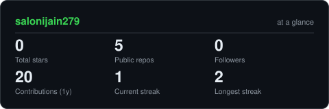
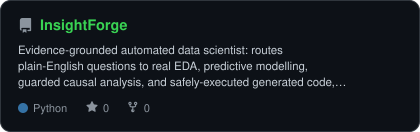
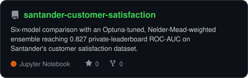

<!-- PORTRAIT - generated by scripts/dotify.py from your photo.
     Colour mode, so one file serves both GitHub themes. Regenerate with:
       python scripts/dotify.py me.jpg -o assets/portrait \
         --cols 100 --equalize --detail 0.5 --color -->

 

<!-- NAME / TAGLINE - animated typing -->

 

<!-- SOCIALS -->

---

## About Me

Hi, I'm **Saloni Jain** 👋 — MS in Business Analytics at the **Carlson School of Management,
University of Minnesota**. I build things at the intersection of applied ML and business
decision-making, then explain what they actually mean.

- 📊 Built a 6-model ensemble reaching **0.827 ROC-AUC** on Santander's customer-satisfaction benchmark
- 🔨 Built **[InsightForge](https://github.com/salonijain279/InsightForge)**, an evidence-grounded automated data scientist for tabular data
- 🎯 Open to **Business Analyst / Data Analyst and AI-in-business roles**, 2026
- 📚 Learning **applied causal inference and MLOps**
- 🛠️ Grounded in **Python, R, SQL, and PySpark** across coursework and Carlson Analytics Lab engagements

 

## Tech Stack

---

## Skill Radar

<table>
<tr>
<td width="50%" align="center" valign="middle">

<!-- Self-rated radar - edit assets/skills.json, the workflow redraws it -->
<picture>
  <source media="(prefers-color-scheme: dark)"  srcset="assets/radar-dark.svg">
  <source media="(prefers-color-scheme: light)" srcset="assets/radar-light.svg">
  
</picture>

</td>
<td width="50%" align="center" valign="middle">

<!-- Live radar built from real language byte counts across your repos -->
<picture>
  <source media="(prefers-color-scheme: dark)"  srcset="assets/radar-langs-dark.svg">
  <source media="(prefers-color-scheme: light)" srcset="assets/radar-langs-light.svg">
  
</picture>

</td>
</tr>
</table>

---

## Contribution Calendar

<!-- 3D isometric calendar, regenerated every 6h by .github/workflows/metrics.yml -->

  

<!-- Snake eats the contribution graph - .github/workflows/snake.yml -->
<picture>
  <source media="(prefers-color-scheme: dark)"  srcset="https://raw.githubusercontent.com/salonijain279/salonijain279/output/snake-dark.svg">
  <source media="(prefers-color-scheme: light)" srcset="https://raw.githubusercontent.com/salonijain279/salonijain279/output/snake.svg">
  
</picture>

---

## GitHub Stats

<!-- Generated by scripts/cards.py into this repo. Deliberately NOT
     github-readme-stats / streak-stats / github-profile-trophy: those are
     shared public instances that go down and take the whole section with them. -->
<picture>
  <source media="(prefers-color-scheme: dark)"  srcset="assets/card-stats-dark.svg">
  <source media="(prefers-color-scheme: light)" srcset="assets/card-stats-light.svg">
  
</picture>

 

  

---

## Featured Projects

<!-- Cards generated by scripts/cards.py from assets/projects.json.
     Stars, forks and language are pulled live from the API on every run.
     VIX Volatility Forecasting and PersonaPath get added here once each is
     pushed (PersonaPath specifically waits on its git-history cleanup). -->
<table>
<tr>
<td width="50%" align="center">
  <a href="https://github.com/salonijain279/InsightForge">
    <picture>
      <source media="(prefers-color-scheme: dark)"  srcset="assets/card-InsightForge-dark.svg">
      <source media="(prefers-color-scheme: light)" srcset="assets/card-InsightForge-light.svg">
      
    </picture>
  </a>
</td>
<td width="50%" align="center">
  <a href="https://github.com/salonijain279/santander-customer-satisfaction">
    <picture>
      <source media="(prefers-color-scheme: dark)"  srcset="assets/card-santander-customer-satisfaction-dark.svg">
      <source media="(prefers-color-scheme: light)" srcset="assets/card-santander-customer-satisfaction-light.svg">
      
    </picture>
  </a>
</td>
</tr>
</table>

| project | stack | result |
|---|---|---|
| **[InsightForge](https://github.com/salonijain279/InsightForge)** | `Python` `Streamlit` `LLM` | Routes plain-English questions to real EDA, modelling, and guarded causal analysis |
| **[santander-customer-satisfaction](https://github.com/salonijain279/santander-customer-satisfaction)** | `Python` `scikit-learn` `Optuna` | 0.827 private-leaderboard ROC-AUC |

